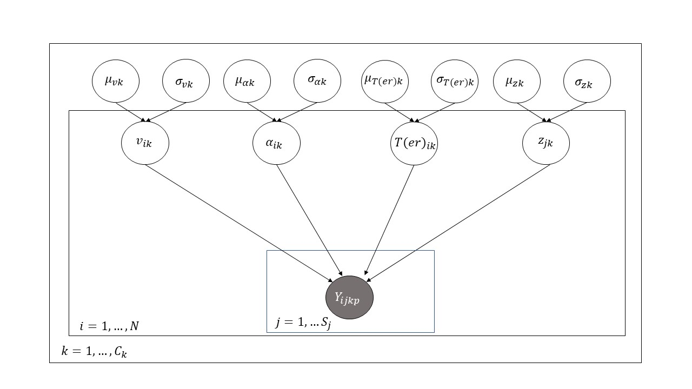

## Method
```{r method-source-data-prep, child = "./markdown/data_prep.rmd"}
```

### Participants
```{r method-source-power-analysis, child = "./markdown/power_analysis.rmd", eval = TRUE}
```
We recruited a total of `r demo_output$n_subjects` participants (`r demo_output$n_women` females, M = `r round(demo_output$mean_age, 2)`, SD = `r round(demo_output$sd_age, 2)` years old). Participants were tested in a single session, gave informed consent and received course credit for their participation. With 93 participants a 2x2 repeated measures ANOVA with a power of $0.80$ is sensitive to effect sizes of $\eta^2 =$ `r cohen_f_sensitivity_80` [@R-Superpower].

### Materials
The experiment was programmed using the PsychoPy software (Version 2.5) [@peirce2019]. We used a modified version of the Behavior Adaptation Task (BAT) [@hester2007], a motor-inhibition Go-NoGo task. Stimuli consisted of a stream of the letters X and Y presented in black centrally on a grey background (see Figure \@ref(fig:method-bat-example)). Participants were asked to respond to the letters when they occurred in an alternating pattern (Go trial) but to withhold their response after a repeated presentation of the same stimulus (NoGo trial). Letters measured approximately 2.5 degrees vertically, the fixation cross measured 1 degree horizontally and vertically and was printed black. Participants were seated approximately 60cm away from the monitor.

(ref:method-bat-example-caption) Behavioral Adaptation Task

```{r method-bat-example, fig.cap = paste("(ref:method-bat-example-caption)")}
knitr::include_graphics(
  "images/bat_slide_pp/Slide1.png"
)
```

### Procedure
Participants were asked to respond as quickly and accurately as possible. Instructions on response mappings of stimuli X and Y to the response keys D and L were counterbalanced across participants. Stimuli were presented for 800ms or until a response was given. We set the RSI to 200ms for the short condition and to 1000ms for the long condition. A fixation cross was presented during the entire RSI. Participants completed 30 practice trials, of which the first half used a long RSI and the second half used a short RSI. Participants received feedback regarding their performance only in practice trials. When participants erroneously responded in a NoGo-trial, they were additionally reminded not to respond when stimuli were repeated. The RSI was manipulated between experimental blocks, with six blocks consisting of 250 trials each being presented per RSI condition. Each participant thus completed 3000 trials. NoGo trials made up approximately 25% of trials. Blocks of short and long RSI occurred in an alternating pattern, beginning with the long RSI condition. A self-paced break followed each experimental block. The sequence of appearance of stimuli X and Y was generated pseudo-randomly. Fourfold repetitions of a stimulus were prohibited, and NoGo-trials were always preceded by another NoGo trial or at least two Go trials. This ensures that post-error trials could never simultaneously be pre-error trials. 

### Data preparation
All response times shorter than 150ms were excluded from analysis. Mean RT and accuracy of each participant for each combination of RSI (short -- long) and trial type (Go -- NoGo) were considered outliers if the participant's mean deviated more than 3 standard deviations from the mean across participants for the respective combination of RSI and trial type. A total of `r n_outliers` participants were excluded due to this criterion, leaving `r demo_output$n_subjects - n_outliers` participants for analysis. Due to the short 800ms response deadline, we chose not to exclude trials on a within-participant basis as this is typically done to remove extraordinarily slow responses.

### Behavioral analysis
Only errors in NoGo trials were considered _error trials_ relevant for analysis, because very few errors of commission occurred in Go trials. Inspection of only the effect of accuracy in NoGo trials allows classification of Go trials based on the accuracy of the previous or following NoGo trial. Go trials following a NoGo-error are defined as trials _E+1_, Go trials preceding NoGo trials were defined as _E-1_ or _C-1_ depending on the accuracy of that NoGo trial. Go-trials following a correct Go trial receive the label _Corr+1_. Trials following correct NoGo trials are excluded from being defined as _post-correct_ because they follow an inhibited response. 
<!-- no C+1 for post-correct because confusing -->

To quantify the impact of an error, we used models testing both the classical approach to PES [@rabbitt1979]
$$\Delta_{PES} = \theta_{E+1} - \theta_{Corr+1}$$ 
as well as the robust approach to PES [@dutilh2012how].
$$ \Delta_{PES} = \theta_{E+1} - \theta_{E-1}$$

When investigating the specific impact of an error-response on the following trial we will conduct our main analyses using the robust definition of PES to account for global shifts in performance^[We also conducted all behavioral and DDM analysis with the classical measure of PES [@dutilh2012how]. Results did not differ significantly, see Appendix C for  details on global performance shifts and model results.]. Parameters and behavioral measures in trials following an error will be compared to trials preceding an error to ensure that post-error trials and trials used to estimate a baseline have the same origin in the dataset. This prevents biased sampling of post-error trials depending on global performance shifts. 

_Pre-error speeding_ effects can be estimated as follows:
$$\Delta_{speed} = \theta_{C-1} - \theta_{E-1}$$

### Bayesian hierarchical drift-diffusion model
The diffusion model was estimated using a Bayesian hierarchical approach implemented in the R-package _brms_ [@R-brms_a]. Hierarchical approaches to the DDM allow simultaneous estimation of parameters on both a population-level and on a subject-level [@vandekerckhove2011; @lee2011; @gelman2006], reducing the number of samples required to estimate model parameters reliably [@wiecki2013; @ratcliff2015; @rouder2005]. Bayesian estimation allows hierarchical extensions of the model otherwise not feasible in frequentist approaches using maximum likelihood estimation [@vandekerckhove2011]. Bayesian approaches generally produce more accurate model estimates [@rouder2005]. Individual-level parameters are assumed to be random samples drawn from a group-level distribution. Group-level distributions thus define between-subjects variability of the parameters and are themselves specified by a set of parameters [@matzke2009]. The ability to fully infer posterior distributions and thus allow a more intuitive quantification of uncertainty is a further benefit of bayesian estimation [@kruschke2010].

### Model comparison
To examine the best-fitting model able to explain post-error effects we tested models using the robust definition of PES. These models include pre-error (E-1) and post-error (E+1) trials in both RSI conditions. We then selectively removed RSI or _error-condition_ as a predictor of the parameters and estimated the pointwise out-of-sample prediction accuracy using the PSIS-LOO criterion [@vehtari2017] approximation implemented in the _loo_ package [@R-loo_b]. Model comparisons were done in a non-hierarchical setting using completely pooled data.

A model with the factors RSI and error-condition both affecting all parameters was used as a baseline. We tested 14 other models that selectively removed one of the factors as a predictor of either all, one or all but one parameters of the model. This results in one baseline model, one model with RSI not impacting any parameters, one model with error-condition not affecting any parameter, four models with only one of the four DDM parameters varying between error-conditions, four models with one of the parameters not being allowed to vary between error-conditions and four models with one of the parameters not being allowed to vary between RSI conditions. The parameter specification of the best fitting model was then employed as reported below.

### Model specification
Let $\mathbf{Y_{(ijk)}}$ represent a response vector of the decision and response time $(X_{(ijk)}, T_{(ijk)})$ for the $i$th participant, in the $j$th trial of the $k$th condition. The data is assumed to follow a Wiener distribution,
$$\mathbf{Y_{(ijk)}} \sim Wiener(a_{(ijk)}, z_{(ijk)}, Ter_{(ijk)}, v_{(ijk)})$$
with the four model parameters boundary separation $a$, bias $z$, non-decision time $T_{er}$ and drift-rate $v$. Responses $X_{(ijk)}$ can take the values $X_{(ijk)} = \{0,1\}$. $X_{(ijk)} = 0$ represents an inaccurate response to a Go trial, corresponding to the lower response boundary in the DDM model. $X_{(ijk)} = 1$ represents a correct response. Response time (in $s$) can take on any value $T_{(ijk)} \in (0, 0.8]$. A response $\mathbf{Y_{(ijk)}}$ of participant $i$ on trial $j$ is further influenced by the combination $k$ of the conditions RSI (short -- long) and location of the trial relative to the error (C-1, E-1, E+1 ...), depending on the measure tested.

All parameters were allowed to vary between conditions (see Figure \@ref(fig:method-display-model-spec)). All intercepts were fixed to zero in order to estimate group-level parameters for each combination of factors rather than deviations from a baseline, easing specification of priors [@singmann2017intro]. The model estimates parameters defining the group-level distribution from which individual-level parameters are then drawn. For example, boundary separation $a_{ik}$ of individual $i$ in condition $k$ is assumed to follow the distribution $a_{ik} \sim N(\mu_{a k}, \sigma_{a k})$.

(ref:method-display-model-spec-caption) Graphical representation of model specification. Shaded nodes represent measured parameters. 

```{r method-display-model-spec, fig.cap = paste("(ref:method-display-model-spec-caption)")}

```


Priors for the group-level parameters were specified in a weakly informative manner. Priors were specified simultaneously for all conditions $k$ of a diffusion model parameter. The index $k$ is thus omitted.

$$\mu_{v} \sim Normal(0, 5)$$
$$\sigma_{v} \sim Gamma(2, 4)$$
$$\mu_{a} \sim Gamma(10, 5)$$
$$\sigma_{a} \sim Gamma(2, 4)$$
$$\mu_{Ter} \sim Gamma(1, 5)$$
$$\sigma_{Ter} \sim Gamma(2, 4)$$
$$\mu_{z} \sim Beta(4, 4)$$
$$\sigma_{z} \sim Gamma(2, 4)$$
```{r method-setup-model}
n_iter <- 3000
n_warmup <- 1000
n_chains <- 4
n_cores <- 64
max_depth <- 15
adapt_delta <- 0.95
seed <- 1234

model_setup_values <- data.frame(n_iter, n_warmup, n_chains, n_cores, max_depth,
                                 adapt_delta, seed)
```

### Model analysis
We will attempt to run 3 different hierarchical models, testing post-error effects in both the classical and robust approach as well as a model testing pre-error speeding. All models run `r model_setup_values$n_chains` chains for `r model_setup_values$n_iter` iterations each, with `r model_setup_values$n_warmup` iterations per chain being used as a warmup to adapt the sampler. The final analysis is based on `r (model_setup_values$n_iter - model_setup_values$n_warmup)*model_setup_values$n_chains` iterations. Treedepth was set to `r model_setup_values$max_depth` and `adapt_delta` was initially set to `r model_setup_values$adapt_delta`. Following checks for model convergence, we will draw posterior samples and asses the fit of the model to our experimental data. We will compare posterior distributions of group-level parameters between levels of the conditions $k$ to investigate the effects of errors and RSI on diffusion model parameters.
